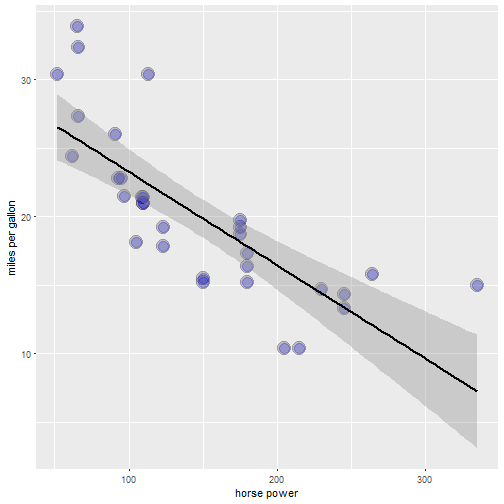

<style>
.title-slide {
  background-color: #ACDBC9;
}

.title-slide hgroup > h1{
 font-family: 'Arial', 'Helvetica', sanserif; 
}

.title-slide hgroup > h1, 
.title-slide hgroup > h2 {
  color: #355C7D;
}

</style>

## Fuel efficiency for the future
<br> </br>
Although electric cars (via Tesla) are increasing daily on our roads affordability and charging infrastructure hinder widespread adoption. 
<br> </br>
Until the cost and proliferation of electric charging stations are overcome, selecting a traditional fuel efficient car is essential to limit carbon emissions. 
<br> </br>
Car manufacturer's fuel efficiency guidlines can't always be trusted, especially in light of the recent Volkswagen emission's scandal. 

--- .class #id 

## Predicting MPG using linear regression
<br> </br>
Using actual car data, spanning multiple models and timeframes, linear regression predictions can assist in chosing a fuel efficient vehicle.  
R studio provides historical sample data of a group of vehicles (mtcars), which is used to predict the miles per gallon value from its horsepower rating. The most recent car data can be sourced and used to make vehicle selection more relevant compared to the data set in Rstudio


```
##                    mpg cyl disp  hp drat    wt  qsec vs am gear carb
## Mazda RX4         21.0   6  160 110 3.90 2.620 16.46  0  1    4    4
## Mazda RX4 Wag     21.0   6  160 110 3.90 2.875 17.02  0  1    4    4
## Datsun 710        22.8   4  108  93 3.85 2.320 18.61  1  1    4    1
## Hornet 4 Drive    21.4   6  258 110 3.08 3.215 19.44  1  0    3    1
## Hornet Sportabout 18.7   8  360 175 3.15 3.440 17.02  0  0    3    2
## Valiant           18.1   6  225 105 2.76 3.460 20.22  1  0    3    1
```

--- .class #id 

## MPG Linear Regression in Action



---

## Shiny Fuel Efficiency Application

Using the previous linear model a Shiny application was developed to predict the MPG value from a current vehicle horsepower rating. 

The link to the application can be found here: [DataProductsFuelEfficiencyApp](https://deonjacobs.shinyapps.io/DataProductsFuelEfficiency/).


